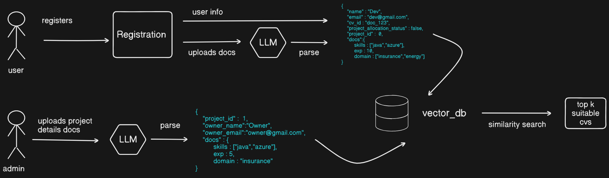

# Project Allocator (Use Case 1)

## Setup
- Create a venv using the following command
  ```bash
  python -m venv venv
  ```
- Activate venv
  ```bash
  source ./venv/Scripts/activate
  ```
- Install python modules
  ```bash
  pip install -r requirements.txt
  ```
- Create .env file, copy contents of .env.example to it and add values

## Folder Structure
    .
    ├── src                       # Source files
        ├── app                   # Application code
        └── references            # References for development
    ├── .env.example             
    ├── .gitignore                
    ├── README.md
    └── requirements.txt

## Architecture
  